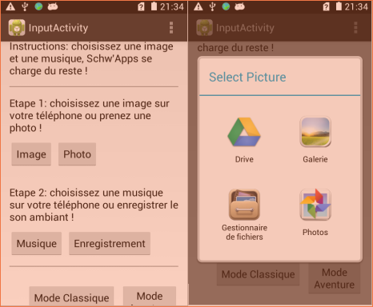

# Application Android
  
  The Projet d’Apprentissage Collaboratif Thématique of Telecom ParisTech, is a teaching unit proposed to all first year students arriving at Télécom ParisTech. Each of the 20 groups (8 students/group) realizes his own project. The originality comes from the fact that the students fix themselves the ambition of their project. This is their responsability to get adequate support and material facilities from teachers.
  
  The assumption of our subject leans on a famous imaginary instrument described by Boris Vian in Froth of the Daydream: the pianococktail. This machine, depending on the music played by the pianist, directly pours a cocktail which flavor reminds of the sensation felt while the song is played. Consequently our basic idea was to link sound and taste through a project which extracts some pieces of information from a song and can generate, starting from its analysis, a cocktail recipe.
  
 This could be done thanks to an Android application that will give the users a recipe and explain to them how the choice was made in order to make a difference compared to a random choice. Furthermore, we have the idea to add another feature: the use of a picture to complete the cocktail creation. The goal is to analyze this picture chosen by the user and get some pieces of information regarding how the consumer feels thanks to hints given by the colors of this picture combined with data extracted from the music in order to make them part of the cocktail choice.
  
# Implemented modules
  
  I coded an Adaboost algorithm to do recognition of musics by genre.
  The database used was composed of 5 music kinds (rock, pop, disco, classique, jazz.), it used the MFCC (Mel Frequency Cepstrum coefficients) as a vector to characterize musics.
  
# Screenshots 

# Poster

[Poster.pdf](Poster.pdf)

  
  
  
  
